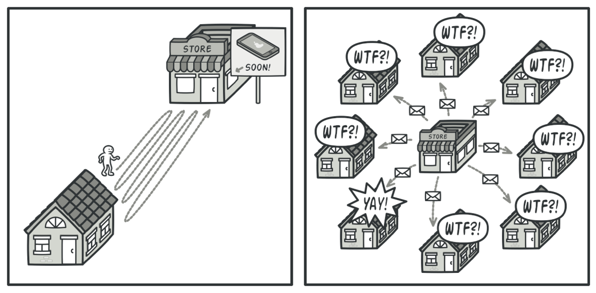
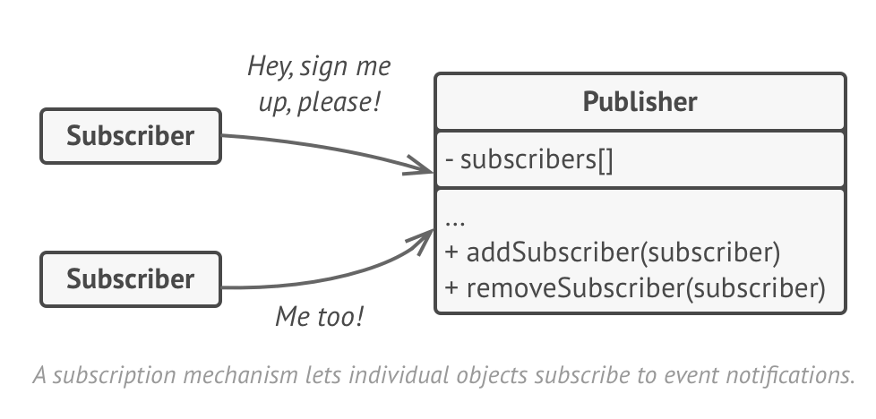
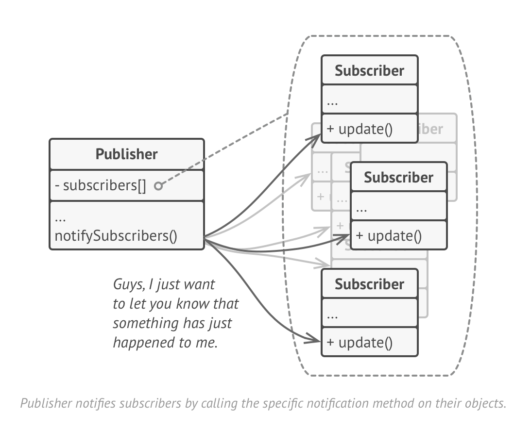
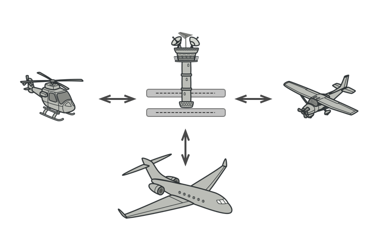

<!-- Run this slideshow via the following command: -->
<!-- reveal-md README.md -w -->


<!-- .slide: class="header" -->

# Behavioral Patterns Pt.2

## [Slides](https://make-school-courses.github.io/MOB-2.4-Advanced-Architectural-Patterns-in-iOS/Slides/04-Behavioral-PatternsPt.2/README.html ':ignore')

<!-- INSTRUCTOR:
1) For the quiz in the Initial Exercise:
- the URL is xxxx
https://docs.google.com/document/d/1giZglDE141ewuj1fGunZhTqCRq0pA11SO-Sta_yYT60/edit

- Answers are listed in a comment in the Initial Exercise section

2) For Activity 1:
- see below Additional Resources

3) for Activity 2:
- see below Additional Resources
-->

<!-- > -->

## Learning Objectives

By the end of this lesson, you should be able to...

1. Describe:
  - the **Observer** and **Mediator** patterns
  - the software construction problem each is intended to solve
  - potential use cases for each (when to use them)
3. Assess:
  - the suitability of a given design pattern to solve a given problem
  - the trade offs (pros/cons) inherent in each
4. Implement basic examples of both patterns explored in this class

<!--

## Initial Exercise

### Part 1 - Individually

*SURPRISE!*... **time for another Quiz!**

<!-- Quiz:

- location:
https://docs.google.com/document/d/1giZglDE141ewuj1fGunZhTqCRq0pA11SO-Sta_yYT60/edit

- Answers:
Question 1. a) App Delegate (Application object is also acceptable, as some Apple documentation stops there)
Question 1. b) It discards it

Question 2. A, G, B, F, C, E, D
-->

<!-- > -->

### Part 2 - As A Class

Review: The After Class coding assignment from previous class.
- Share progress and implementation details with class.

<!-- > -->

### The Observer Pattern  👀



[*refactoring guru*](https://refactoring.guru/images/patterns/content/observer/observer-comic-1-2x.png)

<!--
Customer interested in new iPhone, that's not out yet. They go everyday to the store until they can get it.

Store sends mails to all customers whenever something new comes out = SPAM.

Problem: Customers wastes time with pointless visits to the store or store wastes resources spamming incorrect customers.
-->

<!-- > -->

The **Observer pattern** lets one object observe changes to the **state** of another object without needing to know the implementation of the object observed.

<!-- > -->

Observer is comprised of **two main objects:**

1. **Subject** — The object under observation.
  - The subject object **allows observer objects to register** (and unregister) their interest in receiving updates (notifications) whenever changes are made to the subject, and it **automatically notifies observers** of any state changes.
  - Subjects are **responsible for maintaining a list of their dependents** (observers).

<!-- > -->

2. **Observer(s)** — The object(s) doing the observing.
  - It is the responsibility of observers is **to register (and unregister) themselves on a subject** (to get notified of state changes) and **to update their state** (synchronize their state with subject’s state) when they are notified.

<!-- > -->

This makes subject and observers loosely coupled - subject and observers have no explicit knowledge of each other.

Observers can be added and removed independently at run-time.

<!-- > -->

### Implementation Notes

The observer pattern is implemented correctly when an object can receive notifications without being tightly coupled to the object that sends them.

<!-- > -->

The key to implementing the Observer pattern is to **define the interactions** between the Subject and Observer objects **using protocols**. Subject and Observer protocols should contain methods to:

- **Add Observers**
- **Remove Observers**
- **Notify Observers**

<!-- > -->



[*refactoring guru*](https://refactoring.guru/design-patterns/observer)

<!-- > -->



[*refactoring guru*](https://refactoring.guru/design-patterns/observer)

<!-- > -->

**Example**

```swift
// The Observable protocol that will be used by subjects.
protocol Observable {
    func addObserver(_ observer:Observer)
    func removeObserver(_ observer:Observer)
    var observers : [Observer] {get set}
}

// The Observer protocol declares the update method.
protocol Observer: class  {
    func update(subject: Subject)
}

//Subject implementation
class Subject: Observable {

    // Keeping a state in the subject, that observers can access
    var state: Int = { return Int.random(in: 0...10) }()

    // Subject maintains a list of its observers
    var observers = [Observer]()

    //Adding an observer
    func addObserver(_ observer: Observer) {
        print("Subject: Attached an observer.\n")
        observers.append(observer)
    }

    //Removing an observer
    func removeObserver(_ observer: Observer) {
        if let idx = observers.firstIndex(where: { $0 === observer }) {
            observers.remove(at: idx)
            print("Subject: Removed an observer.\n")
        }
    }

    // Trigger an update in each observer.
    func notifyObservers() {
        print("Subject: Notifying observers...\n")
        observers.forEach({ $0.update(subject: self)})
    }

    // The Subject would do some business logic that would trigger the notifications
    func someBusinessLogic() {
        print("\nSubject: I'm doing something important.\n")
        state = Int.random(in: 0...10)
        print("Subject: My state has just changed to: \(state)\n")
        notifyObservers()
    }
}


// Observers react to the updates issued by the Subject they had been subscribed to.
class ObserverA: Observer {
    func update(subject: Subject) {
        if subject.state < 3 {
            print("ObserverA: Reacted to the event.\n")
        }
    }
}

class ObserverB: Observer {
    func update(subject: Subject) {
        if subject.state >= 3 {
            print("ObserverB: Reacted to the event.\n")
        }
    }
}
```

<!-- > -->

## Breakout Jigsaw

Get into breakout rooms based on the following topics. Take 5-10 min to research as a group, then split into new groups and share your findings with members of other groups:

**Topics:**

- What are the benefits of the observer pattern?
- What are the pitfalls of the observer pattern?
- When should I use the observer pattern?

<!--#### Problems Addressed

- A one-to-many dependency between objects should be defined without making the objects tightly coupled.

- It should be possible that when one object changes state an open-ended number of dependent objects are updated automatically.

- A single object should be able to notify an open-ended number of other objects.
-->
<!--#### Benefits

- Observer simplifies application design by allowing objects that provide notifications to do so in a uniform way without needing to know how those notifications are processed and acted on by the recipients (i.e., without being tightly coupled).

- It allows us to define “one-to-many” relationships between many observers receiving updates from the same subject.

- The observer pattern allows large and complex groups of objects to cooperate with one another with few dependencies between them.-->


<!--#### Pitfalls

- **Biggest pitfall:** Allowing objects that send and receive notifications to become interdependent.

- Observer __*can cause memory leaks*__: In basic implementation, it requires explicit registration and unregistration. If Subjects hold strong references to Observer to keep them alive, **retain cycles can occur.** Ensuring Subjects hold **weak references to Observers** whenever possible can prevent this.

#### When to use

Use the Observer pattern whenever you want one object to receive changes made on another object but where the sender (Subject) of the notifications does not depend on the recipient (Observer) to complete its work.

__*Do not use*__ the Observer pattern unless the Subject of the notifications is functionally dependent from the recipients (observers): i.e., the observers could be removed from the application without preventing the subject from performing its work.
-->

<!-- > -->

## Example Use Cases

There are several examples of the observer pattern in the Cocoa Touch and Cocoa frameworks.

The Cocoa Touch implementation of the Observer pattern that most programmers encounter is in the UI frameworks, where user interactions and changes in UI component state are expressed using *events* (which are *a type of Notification*).

<!-- > -->

Cocoa implements the observer pattern in two ways:
- **Notifications**
- **Key-Value Observing (KVO)**

<!-- > -->

#### Notifications

Notifications are based on a **subscribe-and-publish** model that allows an object (the publisher) to send messages to other objects (subscribers/listeners).

**The publisher never needs to know anything about the subscribers.**

Notifications are heavily used by Apple.

*(See lessons in MOB 1.3 for more on iOS Notifications)*

<!-- > -->

#### Key-Value Observing (KVO)

Objective-C has a feature called **Key-Value Observing (KVO)** that allows one object to receive notifications when the value of another object’s __*property*__ changes.

It is useful for communicating changes between logically separated parts of your app—such as between models and views.

<!-- > -->

You can use KVO to communicate between Swift objects as long as both of them are derived from `NSObject`, and you use the  `@objc dynamic` keyword when defining the property that will be observed.

*KVO is similar to property observers (`willSet` and `didSet`), except KVO is for adding observers outside of the type definition.*

<!-- > -->

#### Apple's KVO Implementation Steps

In [Using Key-Value Observing in Swift](https://developer.apple.com/documentation/swift/cocoa_design_patterns/using_key-value_observing_in_swift), Apple outlines KVO implementation in four simple steps:

1. Annotate a Property for Key-Value Observing
2. Define an Observer class
3. Associate the Observer with the Property to Observe
4. Respond to a Property Change

<!-- > -->

## KVO Activity

Complete [this activity](assignments/kvo.md) to learn how to implement KVO.

<!-- > -->

## Observer Pattern Activity

You will implement the observer pattern manually.

Take [this working real-life scenario](https://refactoring.guru/design-patterns/observer/swift/example#example-1) and turn it into a working app.

<!-- > -->

### The Mediator Pattern



<!-- > -->

The **Mediator pattern** simplifies peer-to-peer communication between objects by introducing a __*mediator object*__ that acts as a __*communications broker*__ between other objects.

<!-- > -->

Instead of objects communicating directly - and thus requiring knowledge of each other's implementations (i.e., tight coupling) - __*peer objects send messages*__ to each other via the __*mediator object.*__

Mediator joins together colleagues (peers) who share a single interface.

<!-- > -->

#### Implementation Notes

Implementing Mediator typically involves some or all of the following components:

1. **Colleague protocol** - Defines methods and properties each colleague must implement.
2. **Colleague objects** — `Peer objects` that want to communicate with each other `implement the colleague protocol`. `Colleague objects` send messages to and receives messages from other colleagues through an associated mediator object.

<!-- > -->

3. **Mediator protocol** — Defines methods and properties the mediator class must implement.
4. **Mediator object** - `Implements the mediator protocol.` __*Coordinates and controls communication*__ between all colleague objects.

<!-- > -->

5. **Client object** – Creates colleagues and associates an appropriate mediator object with each.

<!-- > -->

__*When is the pattern implemented correctly?*__  

 - When each object deals only with the mediator and has no direct knowledge of its peers.

<!-- > -->

## Breakout Jigsaws

Get into breakout rooms based on the following topics. Take 5-10 min to research as a group, then split into new groups and share your findings with members of other groups:

**Topics:**

- What are the benefits of the mediator pattern?
- What are the pitfalls of the mediator pattern?
- When should I use the mediator pattern?

<!--#### Benefits

This design pattern __*promotes loose coupling*__ by keeping objects from referring to each other explicitly, and it __*lets you vary their interaction independently.*__

Mediator reduces chaotic dependencies between objects. The pattern restricts direct communications between the objects and forces them to collaborate indirectly, and only through a mediator object.

As a result, the __*components depend only on a single mediator class*__ instead of being coupled to dozens of their colleagues.

#### Pitfalls

- It is important that the mediator object *not* provide peers with access to one another so that they might become interdependent.

- Over time, a mediator object can evolve into a __*God Object.*__ <sup>3</sup>

#### When to use

Use this pattern when...

- __*dealing with a group of objects*__ that need to communicate freely between one another.
- __*designing reusable components,*__ but dependencies between the potentially reusable pieces might result in tight coupling.
- you need one or more __*colleagues to act upon events initiated by another colleague*__ and want this colleague to generate further events which, in turn, further affect other colleagues.

**Do not use** this pattern if you have one object that needs to send notifications to a range of disparate objects — consider using the Observer pattern instead.

__*Example Use Case -*__ The most popular usage of the Mediator pattern in Swift code is facilitating communications between GUI components of an app. *The Mediator objects fits into the* __*Controller*__ *role of MVC.*
-->
<!-- TODO: add related patterns
-->

<!-- > -->

## In Class Activity

Complete [this activity](assignments/mediator.md) to learn how to implement the mediator pattern

<!-- > -->

## After Class

1. Look up these other Behavioral Patterns:
  - Visitor
  - Iterator
  - Memento
  - Strategy

<!-- > -->

2. Research the following concepts:
  - The Lapsed Listener Problem
  - `NSKeyValueObserving` and its `addObserver` function
  - `NSKeyValueChangeKey`
  - `NSKeyValueObservingOptions`

<!-- > -->

3. **TODO:** Extend the Media Player app you created in the previous class by implementing the following using either the Observer or the Mediator pattern:
  - add a notification that, when the video clip is done playing, sends the user this message: "Your media file is done playing — do you want to replay it?"

<!-- > -->

4. **TODO:** Analyze the following simple implementation of the Observer pattern (KVO).
  - For discussion in next class, pay particular attention to the `.observe(_:_)` function, especially the implications of its origin (where does it come from?) and purpose.

```swift
import UIKit

@objc class Person: NSObject {
    @objc dynamic var name = "Peter Gene Bayot Hernandez"
}

let peter = Person()
print(peter.name)// prints ""Peter Gene Bayot Hernandez"

peter.observe(\Person.name, options: .new) { person, change in
    print("I'm now called \(person.name)")
}

peter.name = "Bruno Mars" // prints "I'm now called Bruno Mars"
```

<!-- > -->

## Additional Resources

2. [Observer pattern - wikipedia](https://refactoring.guru/design-patterns/observer)
4. [Mediator pattern - wikipedia](https://refactoring.guru/design-patterns/mediator)
4. [God Object - wikipedia](https://en.wikipedia.org/wiki/God_object) <sup>3</sup>
5. [Using Key-Value Observing in Swift](https://developer.apple.com/documentation/swift/cocoa_design_patterns/using_key-value_observing_in_swift)
6. [Lapsed Listener Problem - wikipedia](https://en.wikipedia.org/wiki/Lapsed_listener_problem)
7. [Design Patterns on iOS using Swift – Part 2/2 - from Ray Wenderlich](https://www.raywenderlich.com/476-design-patterns-on-ios-using-swift-part-2-2)
- Contains descriptions and examples of the Observer pattern in iOS, including both Notifications and KVO, with a simple, excellent KVO example in which a `UIActivityIndicator` is stopped when there is a change to an `image property`.


<!-- TODO: add:
the lapsed listener problem
https://en.wikipedia.org/wiki/Hedy_Lamarr
-->


<!-- Solution to Activity I:
import Foundation

/* Step 1: Create a Subject class and Annotate a Property for Key-Value Observing */
class Subject : NSObject {
    @objc dynamic var counter = 0
}

/* Step 2: Define an Observer class */
class Observer : NSObject {

    init(subject:Subject) {
        super.init()
        subject.addObserver(self, forKeyPath: "counter",
                            options: NSKeyValueObservingOptions.new, context: nil)
    }

    override func observeValue(forKeyPath keyPath: String?, of object: Any?, change: [NSKeyValueChangeKey : Any]?, context: UnsafeMutableRawPointer?) {

        print("Notification: \(String(describing: keyPath)) = \(String(describing: change?[NSKeyValueChangeKey.newKey]!))");

    }
}
/* Step 3: Associate the Observer with the Property to Observe */
let subject = Subject()
let observer = Observer(subject: subject)

/* Step 4: Respond to a Property Change */
subject.counter += 11
subject.counter = 99

-->

<!-- Solution to Activity II:
import UIKit

// Colleague protocol
protocol Receiver {
    associatedtype MessageType
    func receive(message: MessageType)
}

// Mediator protocol {
protocol Sender {
    associatedtype MessageType
    associatedtype ReceiverType: Receiver

    var recipients: [ReceiverType] { get }

    func send(message: MessageType)
}

// Concrete base class implementation of Colleague protocol
class Peer: Receiver {
    var name: String

    init(name: String) {
        self.name = name
    }

    func receive(message: String) {
        print("\(name) received: \(message)")
    }
}

// Colleague class extending base Peer class
class Programmer: Peer {
    let expertise: String

    init(name: String, expertise: String) {
        self.expertise = expertise
        super.init(name: name)
    }

    override func receive(message: String) {
        print("\(name) received: \(message) for possible \(expertise) work")
    }
}

// Colleague class extending base Peer class
class Recruiter: Peer {
    let company: String

    init(name: String, company: String) {
        self.company = company
        super.init(name: name)
    }

    override func receive(message: String) {
        print("\(name) received: \(message). I am a recruiter at \(company)")
    }
}

// Concrete implementation of Mediator protocol
final class MessageMediator: Sender {
    internal var recipients: [Peer] = []

    func add(recipient: Peer) {
        recipients.append(recipient)
    }

    func send(message: String) {
        for recipient in recipients {
            recipient.receive(message: message)
        }
    }
}

// Client
class SpamGenerator {
    func spamSpamSpamSpam(message: String, worker: MessageMediator) {
        worker.send(message: message)
    }
}

let messagesMediator = MessageMediator()
let spamGenerator = SpamGenerator()

let programmer0 = Programmer(name: "Hedy Lamar", expertise: "iOS Development")
let programmer1 = Programmer(name: "Michael Faraday", expertise: "Electrical Engineering")
let recruiter1 = Recruiter(name: "Queen Elizabeth I", company: "Apple")

messagesMediator.add(recipient: programmer0)
messagesMediator.add(recipient: programmer1)
messagesMediator.add(recipient: recruiter1)

spamGenerator.spamSpamSpamSpam(message: "I'd Like to Add you to my LinkedIn Network", worker: messagesMediator)

/* The last line of the code will Print:
Hedy Lamar received: I'd Like to Add you to my LinkedIn Network for possible iOS Development work
Michael Faraday received: I'd Like to Add you to my LinkedIn Network for possible Electrical Engineering work
Queen Elizabeth I received: I'd Like to Add you to my LinkedIn Network. I am a recruiter at Apple
 */
-->
