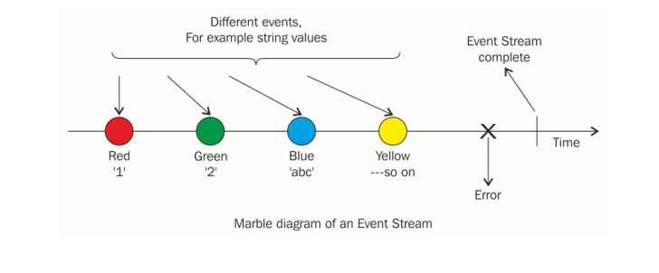
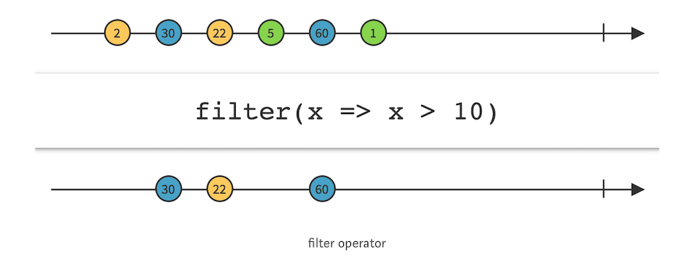
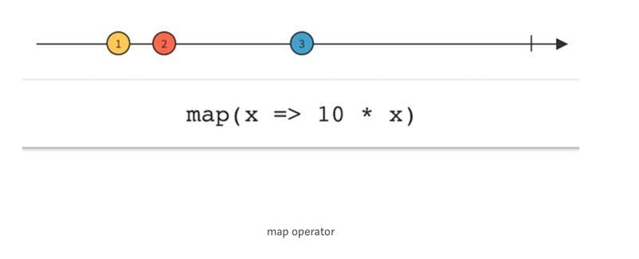
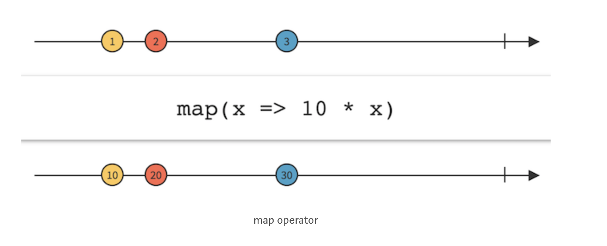
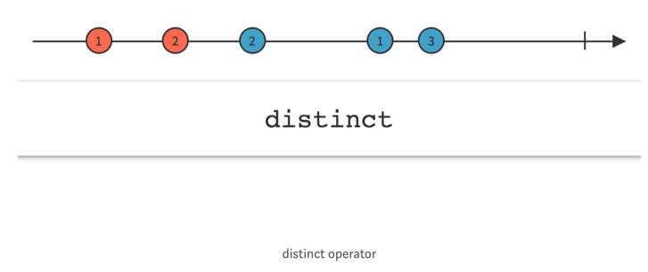

# Reactive Programming (Part 1 of 2)

<!-- INSTRUCTOR NOTES:
1) For Activity 1:
- solutions are hidden (as graphics) below each exercise
3) for Activity 2:
- xxxx
-->

## Minute-by-Minute

| **Elapsed** | **Time**  | **Activity**              |
| ----------- | --------- | ------------------------- |
| 0:00        | 0:05      | Objectives                |
| 0:05        | 0:20      | Initial Exercise          |
| 0:25        | 0:20      | Overview                  |
| 0:45        | 0:15      | In Class Activity I       |
| 1:00        | 0:10      | BREAK                     |
| 1:10        | 0:20      | Overview                  |
| 1:30        | 0:25      | In Class Activity II      |
| TOTAL       | 1:55      |                           |


## Learning Objectives (5 min)

By the end of this lesson, you should be able to...

1. Describe:

<!-- Reactive programming
ReactiveX (Rx)
brief History
problems it is intended to solve, benefits or how it solves them
RxSwift and RxCocoa
how to read Marble diagrams
Basic Building blocks
some basic operators
concepts:
- Event Streams, Sequences, Observables (and their relationship)
Lifecyce of Observables
implement basic examples of:
- Observables -->

<!--
1. Describe:
- the **xxxx** design pattern
- the software construction problem(s) it is intended to solve
- potential use cases for it (when to use it; when not to use it)
3. Assess:
- the suitability of a given design pattern to solve a given problem
- the trade offs (pros/cons) inherent in choosing high-level (MVC, MVVM, etc.) design patterns
4. Implement basic examples of MVVM explored in this class -->


## Overview/TT I (20 min)

### Reactive Programming

Reactive Programming can be thought of as the practice of programming with *asynchronous* data streams, or __*event streams.*__

#### Initial Concepts

In Reactive Programming, an observer *subscribes* to __*an Observable.*__

Observables produce events over a period of time. The process of Observables producing events over a time is referred to as __*emitting.*__

And the observer can react to whatever item or sequence of items the Observable emits.

Events can contain values, including numbers or instances of a custom type, or events can be recognized gestures, such as taps.

__*Operators*__ are __*the building blocks*__ of Reactive Programming, which you can use to transform, process, and react to events emitted by observables.

##### Event Streams
An event stream is a sequence of events happening over time.

An asynchronous data stream is a stream of data where values are *emitted* &mdash; one after another &mdash; with a delay between them, and without blocking program flow to wait for results (Parallelism).

And because the stream is asynchronous, the data emitted can appear anywhere in time &mdash; after a second or two, or even after two minutes.

#### Modeling Event Streams with Marble Diagrams

The common way of modeling asynchronous streams in Rx is to place the emitted values on a time axis in what is called a **Marble Diagram** &mdash; interactive diagrams that depict how Rx operators work with observable sequences over time.

Here, our diagram shows a simple description of a hypothetical event stream, with events represented by colored bubbles drawn at intermittent time intervals:

 </br>

In a Marble Diagram, the left-to-right arrow represents time, and the numbered circles represent elements of a sequence, which are just values plotted on the timeline.

In the last above diagram, pay particular attention to these symbols:
- The **Error** symbol
- The **Event Stream Complete** symbol  

<!-- TODO: add why the relevance of these symbols will be clear soon -->


##### Comparing Arrays to Event Streams

Arrays are sequences in *space*; all items in an array exist in memory.

Event streams, on the other hand, may not exist in space. Events might only occur *over time,* and you may not know all the events that will or can happen, or even when they will occur.

If we consider the scenario in which `eventStreamArray` below started as an empty array (i.e., didn't exist in memory), and each element was populated one-at-a-time over a period of time, then the array will act like an event stream where event  1 (populating `eventStreamArray` with the first element, 2) might happen at the 1st second, event 2 might happen at the 4th second, and so on...

```Swift
  var eventStreamArray = [2, 30, 22, 5, 60, 1]
```

**Diagramming the `filter()` Operator** </br>
One of the most commonly-used Rx operators, `filter()` only emits items from an Observable if a specific condition is met.

In this example, the filtered condition applied to the `eventStreamArray` above is to emit into the resulting stream only those items whose values are `greater than 10`:




## In Class Activity I (30 min)

### In Pairs or As A Class
Marble Diagrams are indispensable when it comes to learning Rx.

Below are 3 Marble Diagrams of hypothetical, generic event scenarios that illustrate 3 of the most commonly used Rx __*transforming operators.*__

However, all 3 diagrams are incomplete: They are all missing the timeline showing the event stream resulting from each of their respective operators.

> __*TIP:*__ You should be familiar with how the first 2 operators work; they are very similar to their HoF counterparts found in the standard Swift libraries, except they work with Observable sequence elements.

**TODO:**
- Study each one of the diagrams and the description of each operator.
- Complete the diagram by filling in the resulting event stream for each operator (*see the `filter()` operator diagram above for hints*).

__*Exercise 1:*__ `map()` &mdash; Transforms items emitted by an Observable by applying a function to each item or converting from one item type into another:


<!--

 -->

__*Exercise 2:*__ `reduce()` &mdash; Applies a function to each item emitted by an Observable, sequentially, and emits the final value:


<!-- 
 -->

__*Exercise 3:*__ &mdash; The `distinct()` suppresses duplicate items emitted by an Observable:

 
 <!--  -->


## Overview/TT II  (20 min)

#### What it is


<!-- Iterator & Observer pattern -->

ReactiveX is a library for composing asynchronous and event-based programs by using observable sequences.

It extends the observer pattern to support sequences of data and/or events and adds operators that allow you to compose sequences together declaratively while abstracting away concerns about things like low-level threading, synchronization, thread-safety, concurrent data structures, and non-blocking I/O.

TODO: Add iterator note...


#### Why learn it

< general reason >

Problems solved by Rx
-
### Problems solved and how xxxx


####  Problems Solved


1. State, and specifically, shared mutable state

2. Imperative programming

3. Side effects


asynchronous


#### synchronous vs asynchronous


TODO: Show synchronous?

As a platform, iOS offers numerous APIs to write asynchronous code and, many a times, this choice becomes hard to manage and a single code base ends up comprising multiple Asynchronous API usages, for example, closures for small Async tasks, delegation for background tasks, notification center for event-based tasks, and such. Managing and modifying such a code base might become a headache even if it is written in the best way possible, and the problem becomes more severe if a big team is involved with a single code base.

TODO: elaborate on this...

For examples, your iOS app might be doing any of the following at any particular moment:
- Reacting to button taps and gestures
- Animating the keyboard as a text field loses focus
- Downloading a large photo from the Internet
- Saving bits of data to disk
- Playing audio
- Tracking GPS location updates


### How Rx solves them

1. Declarative code
In imperative programming, you change state at will. In functional programming, you aim to minimize the code that causes side effects. Since you don’t live in a perfect world, the balance lies somewhere in the middle. RxSwift combines some of the best aspects of imperative code and functional code.


2. Reactive systems
Reactive systems is a rather abstract term and covers web or iOS apps that exhibit most or all of the following qualities:
Responsive: Always keep the UI up to date, representing the latest app state.
Resilient: Each behavior is defined in isolation and provides for flexible error
recovery.
Elastic: The code handles varied workload, often implementing features such as lazy pull-driven data collections, event throttling, and resource sharing.
Message driven: Components use message-based communication for improved reusability and isolation, decoupling the lifecycle and implementation of classes.
Now that you have a good understanding of the problems RxSwift helps solve and how it approaches these issues, it’s time to talk about the building blocks of Rx and how they play together.

#### Brief History

Around 2009, a team at Microsoft released a new client and server side framework called Reactive Extensions for .NET (Rx) that offered a solution to the problems of real-time, scalable, asynchronous app development.

It soon became a built-in core library in the .NET framework.

In 2012, it became an open-source component permitting other languages and platforms to reimplement the same functionality.

Today, it is a cross-platform standard implemented in RxJS, Rx.NET, RxScala, RxSwift, and more...

< TODO: clean up, rework >


Each language-specific implementation of Reactive Programming (ReactiveX) implements a set of operators.

You can read more about the family of Rx implementations at http://reactivex.io. This is the central repository of documentation about Rx’s operators and core classes


#### RxSwift & RxCocoa


< TODO: clean up, rework >

RxSwift also works with all the concepts you’ve covered so far: It tackles mutable state, it allows you to compose event sequences and improves on architectural concepts such as code isolation, reusability and decouplings.


RxSwift finds the sweet spot between traditionally imperative Cocoa code and purist functional code. It allows you to react to events by using immutable code definitions to process asynchronous pieces of input in a deterministic, composable way.

RxSwift closely follows the general API design that RxPython, RxRuby, RxJS, and all other platforms conform to, so it does not include any specific features or integrations with UIKit or Cocoa to aid you in developing for iOS or macOS.


RxCocoa is a standalone library (though it's bundled with RxSwift) that allows you to use many prebuilt features to integrate better with UIKit and Cocoa.
RxCocoa will provide you with out-of-the-box classes to do reactive networking, react to user interactions, bind data models to UI controls, and more.


####  Basic Building blocks

Observables
Subscribing
Subject
Dispose
DisposeBag
Schedulers
Operators


### More on Streams

The word asynchronous means that the data emitted can appear anywhere in time, after one second or even after two minutes, for example.

An event stream can be anything like keyboard inputs, button taps, gestures, GPS location updates, accelerometer, iBeacon, and such.

You can listen to a stream and react to it accordingly.


Event streams (a sequence of events that happen over time).

“In its basic form, it deals with event streams (a sequence of events that happen over time).

Whenever an event occurs, we react to it by doing something.

We could react to events by using for loops but in Functional Programming the transformations are done via map(), filter() and other Rx operators.”


Examples of event streams.

Examples of async event streams.
at any moment, might be doing any of the following things and more:
• Reacting to button taps and gestures
• Animating the keyboard as a text field loses focus
• Downloading a large photo from the Internet
• Saving bits of data to disk
• Playing audio


### Observables (aka, Sequences)


< TODO: clean up, rework >

The most important thing to understand about Rx is:

The equivalence<sup>1</sup> of observer pattern (Observable<Element> sequence) and normal sequences (Sequence) is the most important thing to understand about Rx.


And the kernel of RxSwift is:
Every Observable sequence is just a sequence.
The key advantage for an Observable vs Swift's Sequence is that it can also receive elements asynchronously.


But in RxSwift, Event Streams are called sequences.

in RxSwift, everything is a sequence or something that works with a sequence.

< in fact, you can refer to Observables interchangably as sequences >


And an Observable is just a sequence, with some special powers. One of these powers — in fact the most important one — is that it is asynchronous.


Observable(ObservableType) is equivalent to Sequence
ObservableType.subscribe method is equivalent to Sequence.makeIterator method.
Observer (callback) needs to be passed to ObservableType.subscribe method to receive sequence elements instead of calling next() on the returned iterator.


< other attributes of Observables >


Observables produce events, the process of which is referred to as emitting, over a period of time.


Observable is an array with time dimension


Every Observable is immutable, which means that each stream composition will create a completely new Observable.


A stream is a sequence of ongoing events ordered in time. It can emit three different things: a value (of some type), an error, or a "completed" signal.


#### Lifecycle of an Observable

An Observable can emit (and observers can receive) only three types of events:
- A **Next** event &mdash; An event that “carries” the latest (or "next") data value. This is the way observers “receive” values. An Observable may emit an indefinite amount of these values, until a terminating event is emitted.

A **Completed** event  &mdash;  This event terminates the event sequence with success. It means the Observable completed its life cycle successfully and won’t emit additional events.

- An **Error** event  &mdash; The Observable terminates with an error and will not emit additional events.


But an Observable doesn’t do anything until it receives a subscription.


### Subscribing to Observables

< compare to Notifications >


### Disposing and terminating


### Common operators in swift


## In Class Activity II (30 min)


## Overview/TT III  (20 min)

## In Class Activity III (30 min)


## After Class

- Rx Backpressure Operators


## Wrap Up (5 min)

- Continue working on your current tutorial
- Complete reading
- Complete challenges

## Additional Resources

1. [Slides]()

<!-- TODO: attribute this... -->
https://medium.com/@jshvarts/read-marble-diagrams-like-a-pro-3d72934d3ef5

equivalence<sup>1</sup>
https://github.com/ReactiveX/RxSwift/blob/master/Documentation/MathBehindRx.md
